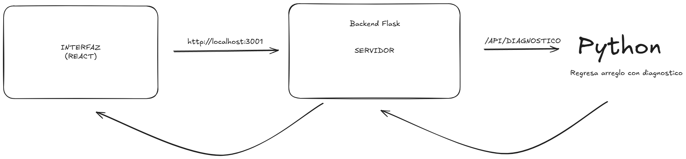

# Sistema Experto de Diagnóstico de Fallas Vehiculares

Este proyecto implementa un sistema experto para diagnosticar fallas en diferentes sistemas de un vehículo. El usuario selecciona síntomas y el sistema infiere posibles causas mediante reglas codificadas en el backend.

El sistema está dividido en dos partes principales: un frontend en React utilizando Vite, y un backend en Flask con reglas de diagnóstico por categorías (motor, frenos, eléctrico, refrigeración, transmisión y suspensión).

## Arquitectura

- Frontend: React + Vite
- Backend: Flask (Python)
- Comunicación: HTTP (Axios)


## Requisitos

- Node.js >= 18
- Python >= 3.9
- pip

## Instalación

### Backend

1. Navegar al directorio backend:

```bash
cd falla_vehicular/backend
```

2. Instalacion de dependencias
```bash
pip install flask flask-cors
```

### Frontend
1. Navegar al directorio frontend:
```bash
cd falla_vehicular/frontend
```
2. Instalacion de dependencias
```bash
npm install
```

3. Ejecutar aplicación React:
```bash
npm run dev
```

